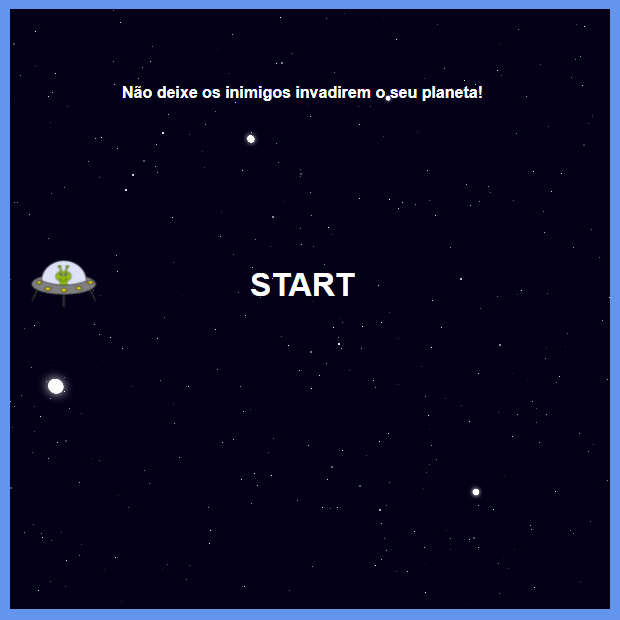
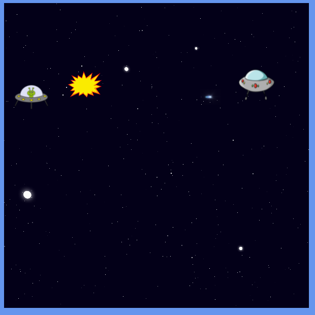

# Space Shooter
Código apresentado no Lab **"Criando Seu Jogo no Estilo Space Shooter"** [da Digital Innovation One](https://digitalinnovation.one).

## Instruções
Para iniciar o jogo, abra o `index.html` no seu navegador da web.

Use as teclas 'Seta para cima' e 'Seta para baixo' para mover a nave verticalmente e a barra de espaços para disparar. Não deixe nenhuma nave inimiga atravessar.

## Tecnologias utilizadas
- HTML
- CSS
- Javascript

## Screenshots

